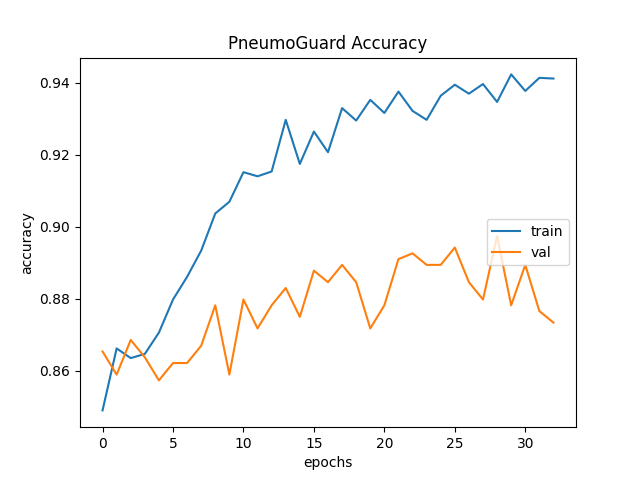

# PneumoGuard

A deep learning model based on the ResNet152 architecture that detects pneumonia from CT scans of lungs. 
The dataset used for training this model can be found [here](https://data.mendeley.com/datasets/rscbjbr9sj/3).

## Methodology

The model was trained for 100 epochs, with early stopping set to kick in at 10, with a batch size of 32. The model was trained on RTX 3080 Ti Laptop GPU.

## Dataset

<table align='center'>
	<tr>
		<td align="center">
			
			
Figure 1: A raw image sample of a normal lung

		</td>
		<td align="center">
			
			
Figure 2: A masked image sample of a normal lung

		</td>
	</tr>
	<tr>
		<td align="center">
			
			
Figure 3: A raw image sample of a pneumonia infected lung

		</td>
		<td align="center">
			
			
Figure 4: A masked image sample of pneumonia infected lung

		</td>
  	</tr>
</table>

## Model Architecture

The model uses a base layer of ResNet152.

    
     
    
Figure 5: PneumoGuard Model Architecture

### ResNet-152

Residual Networks, or ResNets, learn residual functions with reference to the layer inputs, instead of learning unreferenced functions. Instead of hoping each few stacked layers directly fit a desired underlying mapping, residual nets let these layers fit a residual mapping. They stack residual blocks ontop of each other to form network.
ResNet-152, short for "Residual Network 152," is a deep convolutional neural network architecture that belongs to the ResNet family. ResNet-152 is specifically known for its depth, consisting of 152 layers, making it a relatively deep neural network.

## Results

PneumoGuard achieved a training accuracy of 95.23%, training loss of 15.59%, validation accuracy of 89.74%, validation loss of 25.33%, testing accuracy of 87.34%, and testing loss of 38.14%. The accuracy can be further improved by training the model for more epochs and modifying the model architecture.

<table>
  <tr>
    <td align="center">
      
      
Figure 6: PneumoGuard Accuracy Plot

    </td>
    <td align="center">
      
      
Figure 7: PneumoGuard Loss Plot

    </td>
  </tr>
</table>
